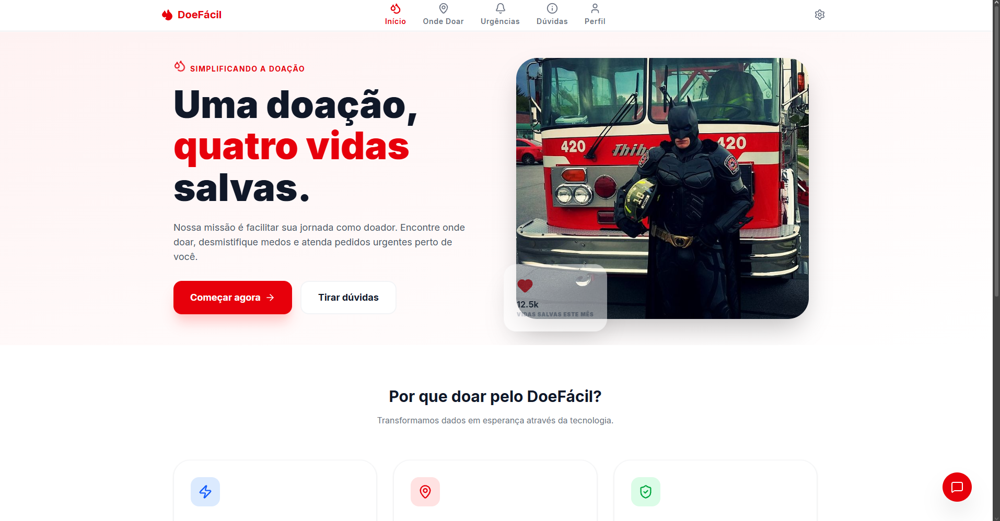
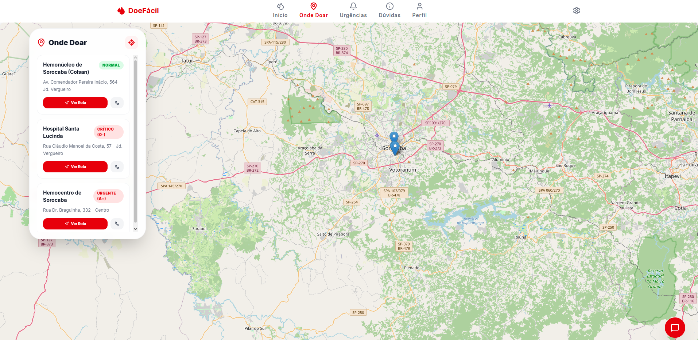
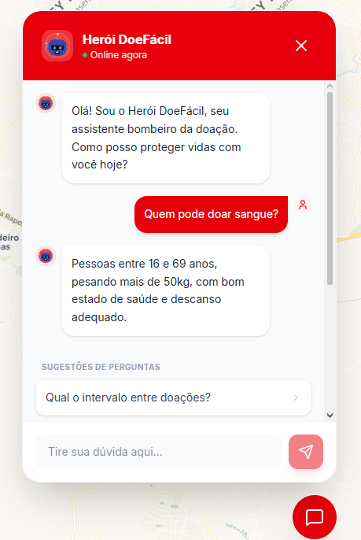
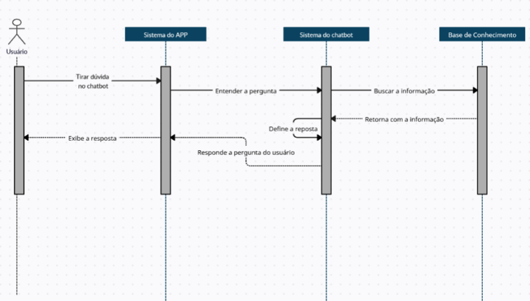
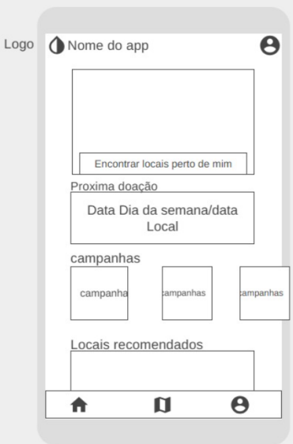
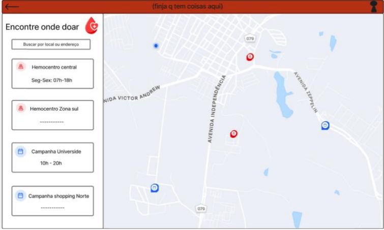

# 🩸 DoeFácil — Plataforma Digital para Incentivo à Doação de Sangue

> **Simplificando a jornada do doador para salvar vidas.**  
> Projeto de Extensão Universitária & Projeto Integrador desenvolvido no curso de Análise e Desenvolvimento de Sistemas da **Universidade de Sorocaba (UNISO)**.
> 
> 1º semestre |2026

[](https://doefacil-ecru.vercel.app)
[](https://react.dev)
[](https://www.typescriptlang.org)
[](https://vitejs.dev)
[](https://tailwindcss.com)
[](https://firebase.google.com)
[](https://aistudio.google.com)

---

> [!IMPORTANT]
> Este é um projeto acadêmico desenvolvido para fins de estudo e avaliação na UNISO. Embora a aplicação esteja publicada e funcional na Vercel, as campanhas, estoques e pontos de doação exibidos não representam dados reais ou ativos. Não utilize esta aplicação como referência para decisões reais sobre doação de sangue — para isso, procure diretamente um hemocentro ou o site oficial do Ministério da Saúde.

---

## 📑 Sumário

- [Visão Geral](#-visão-geral--dores-atacadas)
- [Funcionalidades](#-funcionalidades)
- [Demonstração](#️-demonstração)
- [Arquitetura, Tecnologias & Segurança](#️-arquitetura-tecnologias--segurança)
- [Como Rodar o Projeto](#-como-rodar-o-projeto-localmente)
- [Diagramas de Modelagem](#-diagramas-de-modelagem-do-sistema)
- [Protótipos & Evolução de Interface](#-protótipos--evolução-de-interface-uxui)
- [Documentação Oficial](#-documentação-oficial-do-projeto)
- [Colaboradores](#-colaboradores--créditos)
- [Licença](#-licença)
  
---

## 📌 Visão Geral & Dores Atacadas

No Brasil, **apenas 1,4%[¹] da população é doadora regular de sangue**, mantendo os hemocentros constantemente à beira do desabastecimento. Através de pesquisas de campo com **74 respondentes** e do levantamento de dados clínicos junto ao parceiro **Colsan (Sorocaba)**, identificou-se que **48%[²] dos potenciais doadores deixam de doar por desinformação, medo do procedimento ou entraves logísticos**.

> [!NOTE]
> [¹] Fonte: Relatório Final do Projeto (ver [Documentação Oficial](#-documentação-oficial-do-projeto) mais abaixo).
> 
> [²] Fonte: pesquisa de campo realizada pela equipe com os 74 respondentes citados acima, documentada no mesmo Relatório Final.

### 🎯 Principais Dores Eliminadas pelo DoeFácil:
* **Falta de Informação e Mitos:** O medo do processo e a dúvida sobre requisitos básicos (peso, idade, cirurgias recentes) afastam voluntários.
* **Dificuldade Logística:** Incerteza sobre onde doar, horários de funcionamento e rotas até o posto mais próximo.
* **Invisibilidade do Estoque Crítico:** A população não sabe quando determinado tipo sanguíneo precisa de doações urgentes.
* **Ausência de Histórico do Doador:** Dificuldade em acompanhar o intervalo mínimo exigido entre doações.

O **DoeFácil** centraliza essas necessidades em uma única aplicação web acolhedora e inteligente, alinhando-se aos **Objetivos de Desenvolvimento Sustentável da ONU (ODS 3, 9 e 10)**.

## ✅ Funcionalidades

- 📅 Agendamento de doação em hemocentros parceiros
- 🗺️ Geolocalização e mapa interativo dos pontos de doação
- 🩸 Alertas de estoque crítico por tipo sanguíneo
- 🤖 Chatbot com IA (Gemini API) para tirar dúvidas sobre o processo
- 🔐 Autenticação via Google (Firebase Authentication)
- 📖 Histórico do doador com controle do intervalo mínimo entre doações

🔗 **Acesse a aplicação no ar:** [doefacil-ecru.vercel.app](https://doefacil-ecru.vercel.app)

## 🖥️ Demonstração

| Tela Inicial | Mapa Interativo | Chatbot de Suporte |
|:---:|:---:|:---:|
|  |  |  |

---

## 🛠️ Arquitetura, Tecnologias & Segurança

* **Frontend & UX:** React.js com TypeScript, Vite e Tailwind CSS para componentes modulares e responsivos.
* **Inteligência Artificial:** Integração com a **Gemini API (Google AI Studio)** para respostas em tempo real no Chatbot.
* **Backend & Autenticação:** Firebase (Cloud Firestore e Authentication via Google e E-mail/Senha).
* **Segurança de API:** A chave da Gemini API foi configurada como variável de ambiente (VITE_GEMINI_API_KEY), mantida fora do repositório. Já a configuração do Firebase (identificação do projeto) segue o padrão da própria plataforma, que é pública por natureza — a proteção real de dados fica a cargo das regras do Firestore e dos domínios autorizados no console do Firebase.

---

## 🚀 Como Rodar o Projeto Localmente

**Pré-requisitos:** [Node.js](https://nodejs.org/) 18+, uma conta no [Firebase](https://firebase.google.com/) e uma chave de API do [Google AI Studio / Gemini](https://aistudio.google.com/).

```bash
git clone https://github.com/biason87/doefacil.git
cd doefacil
npm install
cp .env.example .env
```

Preencha o `.env` com suas credenciais (nomes de variável exatos estão em `.env.example`):

```env
VITE_GEMINI_API_KEY=sua_chave_aqui
VITE_FIREBASE_API_KEY=sua_chave_aqui
VITE_FIREBASE_AUTH_DOMAIN=seu_dominio_aqui
VITE_FIREBASE_PROJECT_ID=seu_project_id_aqui
```

```bash
npm run dev
```

A aplicação abre em `http://localhost:5173`.

---


## 📊 Diagramas de Modelagem do Sistema

###  Diagrama de Caso de Uso

<p align="center">
  
</p>

> **Diagrama de Caso de Uso do Sistema DoeFácil**  
> **Explicação:** Este diagrama ilustra as funcionalidades do sistema sob a perspectiva do usuário e do Hemocentro. Ele destaca interações essenciais como o agendamento de doações, a consulta de rotas e o esclarecimento de dúvidas via Chatbot.

---

###  Diagrama de Atividade

<p align="center">
  
</p>

> **Diagrama de Atividade para o fluxo de agendamento**  
> **Explicação:** Representa o passo a passo processual do agendamento de doação. O diagrama utiliza Raias (*Swimlanes*) para dividir as responsabilidades entre o Usuário, o Sistema do APP e o Sistema do Hemocentro, mostrando desde a entrada de dados até a confirmação final do agendamento.

---

###  Diagrama de Sequência

<p align="center">
  
</p>

> **Diagrama de Sequência para consulta no chatbot**  
> **Explicação:** Este diagrama foca na ordem temporal das mensagens trocadas entre os objetos do sistema. Ele detalha como a interface do app comunica-se com o controlador do chatbot e com a Base de Conhecimento (regras da Colsan) para fornecer respostas precisas ao usuário, evidenciando o tempo de ativação de cada componente.

---

## 🎨 Protótipos & Evolução de Interface (UX/UI)

###  Protótipos

####  Esboço Inicial da Tela Principal
<p align="center">
  
</p>

> **Primeira ideia da tela inicial**  
> **Legenda:** Criada para mostrar o esboço do que estaria na tela inicial do aplicativo no seu primeiro protótipo, contendo o mapa interativo, campanhas ativas e o período de doação do usuário.

---

####  Prototipagem do Fluxo de Autenticação e Interface Inicial (Figma)
<p align="center">
  
</p>

> **Ideia da tela de login**  
> **Legenda:** Criada no Figma para saber como ficaria a tela e a tentativa de login feita pelo usuário.

---

<p align="center">
  
</p>

> **Telas iniciais**  
> **Legenda:** Criada no Figma com maior fidelidade para uma melhor visão da tela inicial do aplicativo, contendo o mapa da cidade e os alertas de estoque de sangue nos hemocentros próximos.

---

####  Tela Inicial Refinada com Auxílio de IA
<p align="center">
  
</p>

> **Tela inicial com ajuda da IA**  
> **Legenda:** Criada pelo Google AI para ser o mais próximo da versão final do site já disponível para uso, mostrando a parte de emergências do aplicativo.

---

####  Evolução do Concept do Mapa Interativo
<p align="center">
  
</p>

> **Ideia do mapa interativo**  
> **Legenda:** Criada no Figma para ser o conceito inicial do mapa interativo do aplicativo, contendo os pontos de doação e as campanhas ativas.

---

####  Tela de Agendamento
<p align="center">
  
</p>

> **Ideia da Tela de agendamento**  
> **Legenda:** Criada no Figma para ser a tela de agendamento de doação, onde o usuário escolheria o local desejado para doar e faria o agendamento.

---

## 📄 Documentação Oficial do Projeto

Para consultar o planejamento inicial, o embasamento teórico, a metodologia de extensão e as validações técnicas do **DoeFácil**, acesse os documentos oficiais do projeto em PDF:

* 📋 **[Termo de Abertura do Projeto — TAP (PDF)](docs/TAP-DoeFacil.pdf)**  
  *Contém a justificativa, objetivos, premissas, riscos, alinhamento com os ODS da ONU e mapa de partes interessadas.*

* 📑 **[Relatório Acadêmico & Técnico Completo (PDF)](docs/Relatorio-Final-DoeFacil.pdf)**  
  *Contém o embasamento teórico, resultados da pesquisa de campo (74 respondentes), diagrama de modelagem do sistema e fluxo de prototipagem.*

---

## 👥 Créditos

**Desenvolvimento do site:** Ketilyn Biason, individualmente (front-end e publicação), com apoio do Gemini a partir de protótipos e prompts próprios.

**Projeto Integrador (1º semestre):** pesquisa de campo, documentação, protótipos e diagramas que serviram de base ao site, feitos em grupo por Ketilyn Biason (P.O.), Jorge L. Zacarias, Maria C. Borges, Matheus Casaburi, Matheus O. Silverio e Rafael V. Bruneti.

Projeto acadêmico do curso de Análise e Desenvolvimento de Sistemas da UNISO.

---

## 📜 Licença

Todos os direitos reservados. Consulte o arquivo [LICENSE](LICENSE) — uso comercial ou redistribuição não são permitidos sem autorização da autora.
