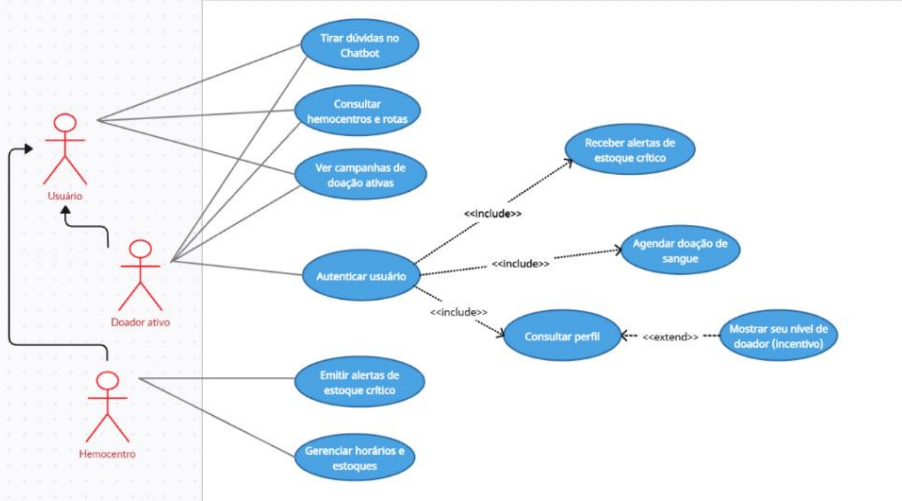
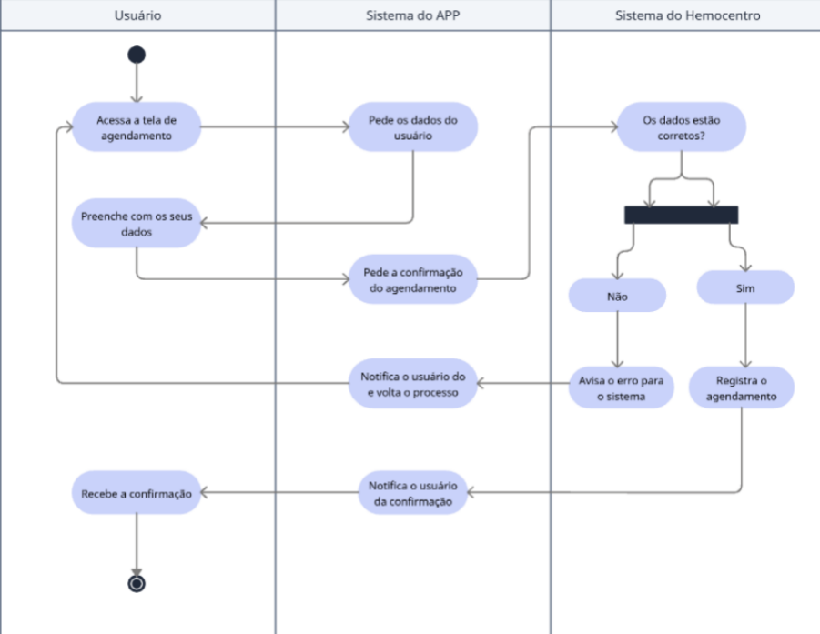
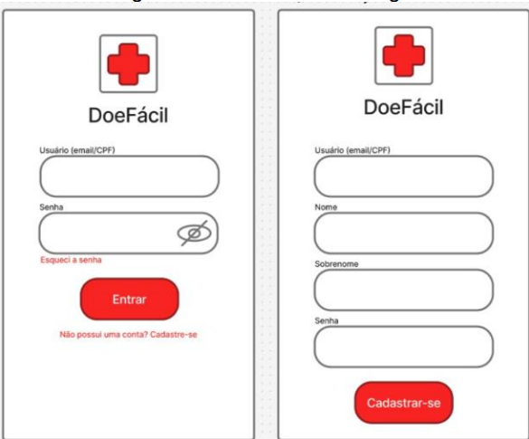
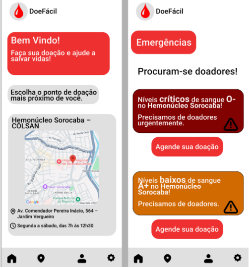
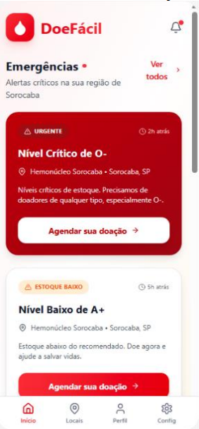
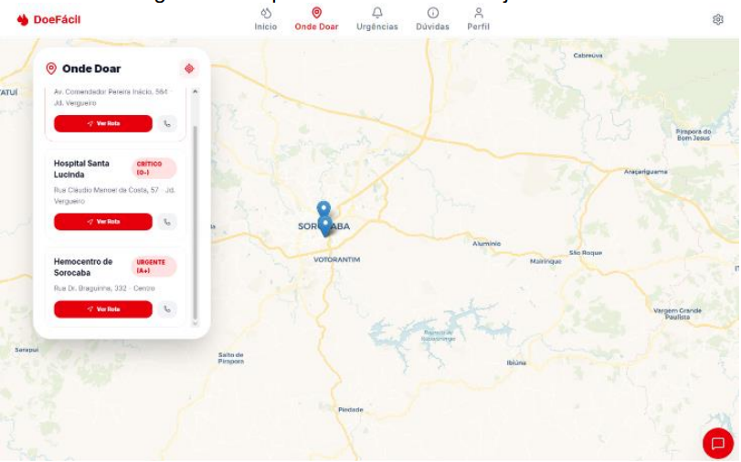
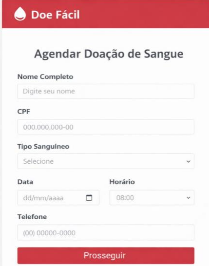

# 🩸 DoeFácil — Plataforma Digital para Incentivo à Doação de Sangue

> **Simplificando a jornada do doador para salvar vidas.**  
> Projeto de Extensão Universitária & Projeto Integrador desenvolvido no curso de Análise e Desenvolvimento de Sistemas da **Universidade de Sorocaba (UNISO)**.

---

## 📌 Visão Geral & Dores Atacadas

No Brasil, **apenas 1,4% da população é doadora regular de sangue**, mantendo os hemocentros constantemente à beira do desabastecimento[cite: 1, 2]. Através de pesquisas de campo com **74 respondentes** e do levantamento de dados clínicos junto ao parceiro **Colsan (Sorocaba)**, identificou-se que **48% dos potenciais doadores deixam de doar por desinformação, medo do procedimento ou entraves logísticos**.

### 🎯 Principais Dores Eliminadas pelo DoeFácil:
* **Falta de Informação e Mitos:** O medo do processo e a dúvida sobre requisitos básicos (peso, idade, cirurgias recentes) afastam voluntários.
* **Dificuldade Logística:** Incerteza sobre onde doar, horários de funcionamento e rotas até o posto mais próximo.
* **Invisibilidade do Estoque Crítico:** A população não sabe quando determinado tipo sanguíneo precisa de doações urgentes.
* **Ausência de Histórico do Doador:** Dificuldade em acompanhar o intervalo mínimo exigido entre doações.

O **DoeFácil** centraliza essas necessidades em uma única aplicação web acolhedora e inteligente, alinhando-se aos **Objetivos de Desenvolvimento Sustentável da ONU (ODS 3, 9 e 10)**.

🔗 **Acesse a aplicação no ar:** [doefacil-ecru.vercel.app](https://doefacil-ecru.vercel.app)

---

## 📊 Diagramas de Modelagem do Sistema

###  Diagrama de Caso de Uso

  

> ** Diagrama de Caso de Uso do Sistema DoeFácil**  
> **Explicação:** Este diagrama ilustra as funcionalidades do sistema sob a perspectiva do usuário e do Hemocentro[cite: 1, 2]. Ele destaca interações essenciais como o agendamento de doações, a consulta de rotas e o esclarecimento de dúvidas via Chatbot.

---

###  Diagrama de Atividade

  

> ** Diagrama de Atividade para o fluxo de agendamento**  
> **Explicação:** Representa o passo a passo processual do agendamento de doação[cite: 1, 2]. O diagrama utiliza Raias (*Swimlanes*) para dividir as responsabilidades entre o Usuário, o Sistema do APP e o Sistema do Hemocentro, mostrando desde a entrada de dados até a confirmação final do agendamento.

---

###  Diagrama de Sequência

  

> ** Diagrama de Sequência para consulta no chatbot**  
> **Explicação:** Este diagrama foca na ordem temporal das mensagens trocadas entre os objetos do sistema[cite: 1, 2]. Ele detalha como a interface do app comunica-se com o controlador do chatbot e com a Base de Conhecimento (regras da Colsan) para fornecer respostas precisas ao usuário, evidenciando o tempo de ativação de cada componente.

---

## 🎨 Protótipos & Evolução de Interface (UX/UI)

###  Protótipos

####  Esboço Inicial da Tela Principal

  

> ** Primeira ideia da tela inicial**  
> **Legenda:** Criada para mostrar o esboço do que estaria na tela inicial do aplicativo no seu primeiro protótipo, contendo o mapa interativo, campanhas ativas e o período de doação do usuário.

---

####  Prototipagem do Fluxo de Autenticação e Interface Inicial (Figma)

  

> ** Ideia da tela de login**  
> **Legenda:** Criada no Figma para saber como ficaria a tela e a tentativa de login feita pelo usuário.

  

> ** Telas iniciais**  
> **Legenda:** Criada no Figma com maior fidelidade para uma melhor visão da tela inicial do aplicativo, contendo o mapa da cidade e os alertas de estoque de sangue nos hemocentros próximos.

---

####  Tela Inicial Refinada com Auxílio de IA

  

> ** Tela inicial com ajuda da IA**  
> **Legenda:** Criada pelo Google AI para ser o mais próximo da versão final do site já disponível para uso, mostrando a parte de emergências do aplicativo.

---

####  Evolução do Concept do Mapa Interativo

  

> ** Ideia do mapa interativo**  
> **Legenda:** Criada no Figma para ser o conceito inicial do mapa interativo do aplicativo, contendo os pontos de doação e as campanhas ativas.

  

> **Figura 14: Mapa interativo feito com ajuda da IA**  
> **Legenda:** Criada pelo Google AI para ser a versão refinada do mapa interativo, melhorando a interface dos pontos de doação e das campanhas.

---

####  Tela de Agendamento

  

> **Figura 15: Ideia da Tela de agendamento**  
> **Legenda:** Criada no Figma para ser a tela de agendamento de doação, onde o usuário escolheria o local desejado para doar e faria o agendamento.

---

## 🛠️ Arquitetura, Tecnologias & Segurança

* **Frontend & UX:** React.js com TypeScript, Vite e Tailwind CSS para componentes modulares e responsivos.
* **Inteligência Artificial:** Integração com a **Gemini API (Google AI Studio)** para respostas em tempo real no Chatbot.
* **Backend & Autenticação:** Firebase (Cloud Firestore e Authentication via Google e E-mail/Senha).
* **Segurança de API:** A chave da API foi configurada em ambiente restrito com variáveis de ambiente (`VITE_GEMINI_API_KEY`), garantindo a execução na **Vercel** sem exposição de segredos no repositório.

---

## 👥 Colaboradores & Créditos

Projeto desenvolvido pelos alunos do curso de Análise e Desenvolvimento de Sistemas da UNISO:
* **Ketilyn Biason** — *Product Owner (P.O.) & Desenvolvedora Front-end*
* **Equipe de Desenvolvimento (UNISO):** Jorge L. Zacarias, Maria C. Borges, Matheus Casaburi, Matheus O. Silverio, Rafael V. Bruneti.
